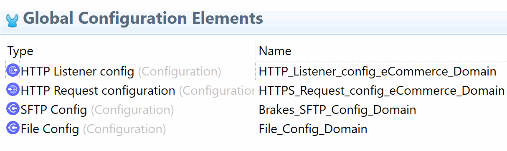

# Brakes eCommerce Integration

**Projects:**
* ecommerce-domain
* error-handler
* Environments
* statuscheck
* account-process
* product-process
* sales-order-process
* csv2hecommerce-domainybris
* listingandexclusions
* ecommerce-domain  
## ecommerce-domain

### Description
A Mule Domain Project is implemented to configure the resources that are shared among different projects. These resources can be used by all the projects associated with this domain. Mule applications can be associated with only one domain, but a domain can be associated with multiple projects.  
### Configuration
##### HTTP_Listener_config_eCommerce_Domain
```sh
<http:listener-config name="HTTP_Listener_config_eCommerce_Domain" doc:name="HTTP Listener config" doc:id="bd588af0-ef63-4632-8b83-42853374973e" >
	<http:listener-connection host="0.0.0.0" port="8081" />
</http:listener-config>
```
##### HTTPS_Request_config_eCommerce_Domain
```sh
<http:request-config name="HTTPS_Request_config_eCommerce_Domain" doc:name="HTTP Request configuration" doc:id="cd7000aa-b997-4356-b8a6-176e15cb55c8" basePath="${ECOMMERCE_BASEPATH}" >
	<http:request-connection host="${ECOMMERCE_HOST}" port="${ECOMMERCE_PORT}" protocol="HTTPS" connectionIdleTimeout="60000">
		<http:authentication >
			<http:basic-authentication username="${ECOMMERCE_USER}" password="${ECOMMERCE_PASSWORD}" />
		</http:authentication>
	</http:request-connection>
</http:request-config>
```
##### Brakes_SFTP_Config_Domain
```sh
<sftp:config name="Brakes_SFTP_Config_Domain" doc:name="SFTP Config" doc:id="db9e102a-ce58-45bb-82c1-bde9ab904cf4" >
	<sftp:connection host="${SFTP_HOST}" username="${SFTP_USERNAME}" password="${SFTP_PASSWORD}" />
</sftp:config>
```
##### File_Config_Domain
```sh
<file:config name="File_Config_Domain" doc:name="File Config" doc:id="931c4e8c-5366-4ae3-a556-4a3892f5438f" >
	<file:connection workingDir="/" />
</file:config>
```
##### Import
The Import has the Config file with SAP Specific connector configuration, it's imported based on the specific envirnment(dev,qas,ppd or prd).
```sh
<import doc:name="Import" doc:id="56f4a1a0-d932-49b3-b1ae-dde507735c49" file="${ENVCODE}-mule-domain-config.xml" />
```
##### error-handler
##### Environments
##### statuscheck
##### account-process
##### product-process
##### sales-order-process
##### csv2hybris
##### listingandexclusions
